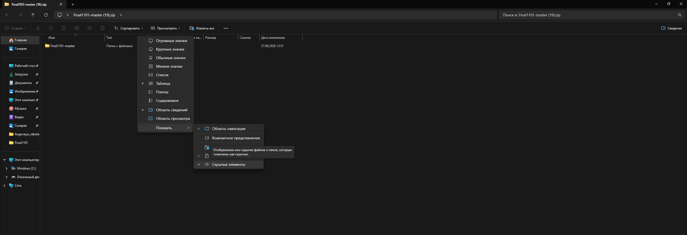
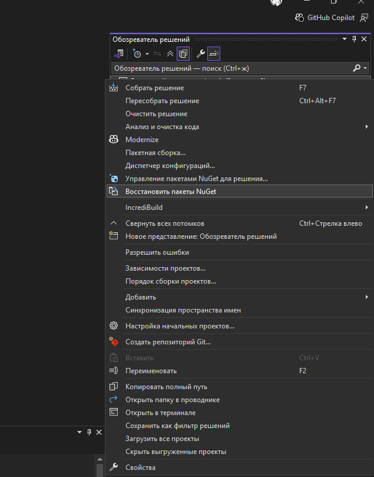
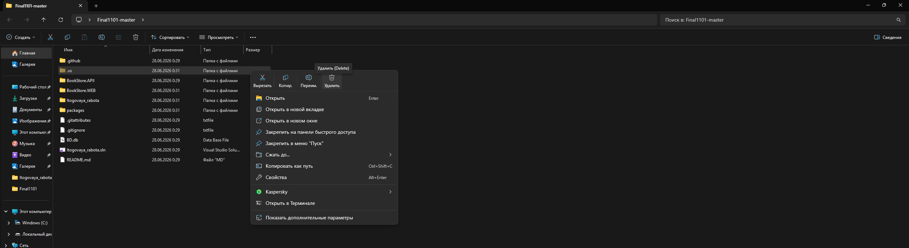

# Final1101

# ЗАПУСК ПРОЕКТА ОЧЕНЬ ВАЖНО!!!

---

## Описание проекта

Информационная система книжного магазина.

Проект включает:

- WPF-приложение
- ASP.NET MVC Web-приложение
- API

Функционал:

- просмотр товаров;
- авторизация пользователей;
- оформление заказов;
- просмотр списка заказов;
- работа с базой данных DBeaver Community.

---

## Используемые технологии

- C#
- WPF
- ASP.NET MVC
- Entity Framework 6
- SQLite
- Dapper

---

## Автор Артёмов Дмитрий Сергеевич ИСПП-43
